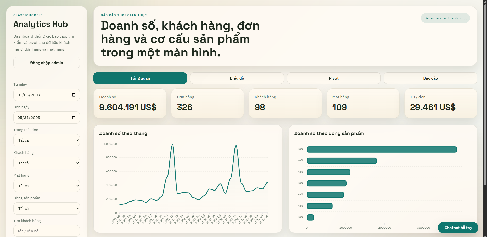
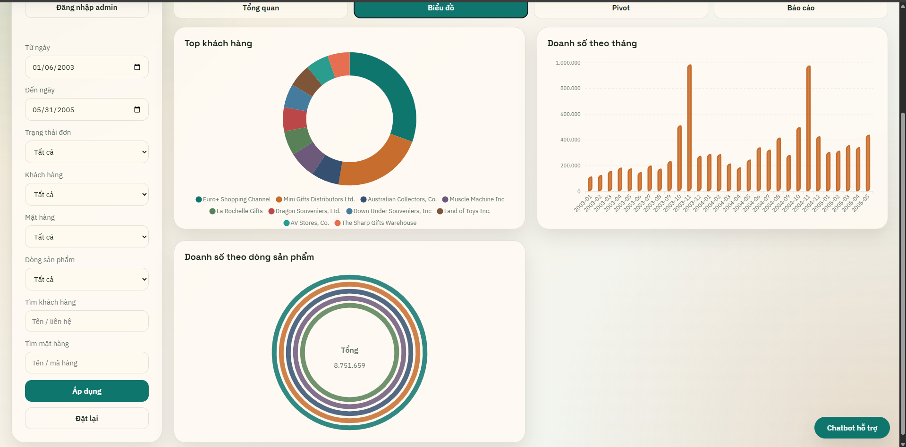
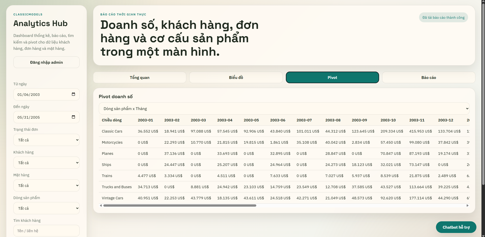
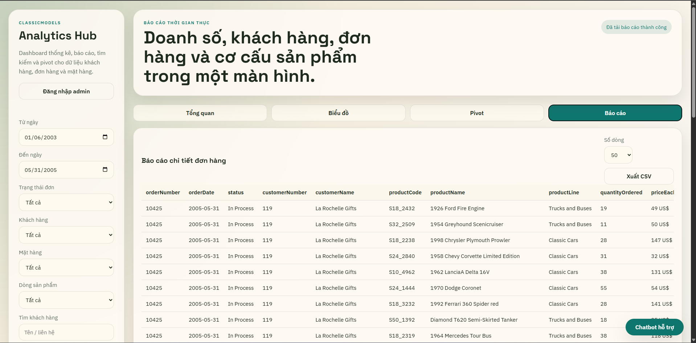
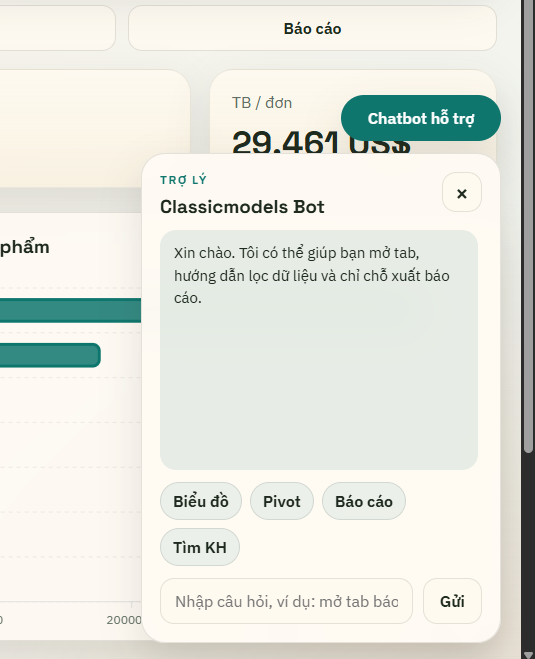

# Classicmodels Analytics Website

Website thống kê và báo cáo cho cơ sở dữ liệu `classicmodels`, gồm:

- Dashboard KPI: doanh số, số đơn hàng, số khách hàng, số mặt hàng, giá trị trung bình mỗi đơn.
- Tìm kiếm và lọc theo thời gian, khách hàng, mặt hàng, dòng sản phẩm, trạng thái đơn hàng.
- Biểu đồ dashboard với `ApexCharts`.
- Pivot doanh số theo `dòng sản phẩm x tháng` hoặc `khách hàng x tháng`.
- Báo cáo chi tiết đơn hàng và xuất CSV.
- Chatbot hướng dẫn thao tác cơ bản trong giao diện.
- Dashboard công khai cho mọi người xem.
- Đăng nhập admin riêng bằng nút `Đăng nhập admin`.
- ORM với `Sequelize`.

## Giao diện

### Tổng quan



### Biểu đồ



### Pivot



### Báo cáo



### Chatbot



## Truy cập hệ thống

### Người xem thường

- Không cần đăng nhập.
- Có thể vào trực tiếp dashboard, dùng bộ lọc, xem biểu đồ, pivot và báo cáo.

### Admin

- Đăng nhập qua nút `Đăng nhập admin` trên giao diện.
- Tài khoản và mật khẩu lấy từ file `.env`:
  - `ADMIN_USERNAME`
  - `ADMIN_PASSWORD`

Hiện tại phần admin mới là session đăng nhập riêng để mở rộng về sau. Dashboard vẫn công khai cho mọi người.

## ORM

Project hiện đã có ORM bằng `Sequelize`:

- [db/sequelize.js](./db/sequelize.js): khởi tạo kết nối ORM.
- [db/models.js](./db/models.js): khai báo model `Customer`, `Order`, `Product`, `ProductLine` và association.

Hiện trạng sử dụng:

- ORM được dùng cho:
  - lấy danh sách khách hàng
  - lấy danh sách dòng sản phẩm
  - lấy danh sách sản phẩm
  - lấy danh sách trạng thái đơn hàng
  - kiểm tra kết nối và session admin
- Raw SQL qua `sequelize.query(...)` vẫn được giữ cho:
  - dashboard tổng hợp
  - pivot
  - báo cáo analytics

## Chạy dự án

1. Cài MySQL và import sample database `classicmodels`.
2. Tạo file `.env` từ `.env.example` và cập nhật thông tin kết nối.
3. Cài package:

```bash
npm install
```

4. Chạy ứng dụng:

```bash
npm start
```

5. Mở `http://localhost:3000`

## Biến môi trường

```env
PORT=3000
DB_HOST=127.0.0.1
DB_PORT=3306
DB_USER=root
DB_PASSWORD=
DB_NAME=classicmodels
ADMIN_USERNAME=admin
ADMIN_PASSWORD=admin123
SESSION_SECRET=change-this-secret
```

## Cấu trúc

- `server.js`: API Express, session admin, truy vấn ORM và analytics.
- `db/sequelize.js`: cấu hình Sequelize.
- `db/models.js`: model và association ORM.
- `public/index.html`: giao diện dashboard và modal đăng nhập admin.
- `public/app.js`: logic đăng nhập admin, gọi API, render chart, pivot, báo cáo, chatbot.
- `public/styles.css`: giao diện responsive.

## Ghi chú

- Session admin hiện được lưu trong memory của tiến trình Node.js, phù hợp cho bài tập hoặc demo nội bộ.
- Nếu cần triển khai production, nên chuyển session sang Redis hoặc database.
